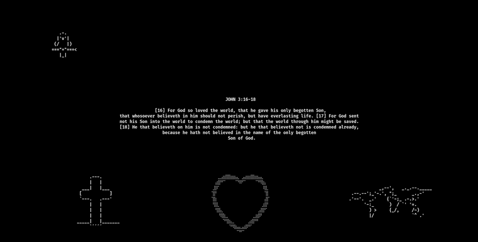
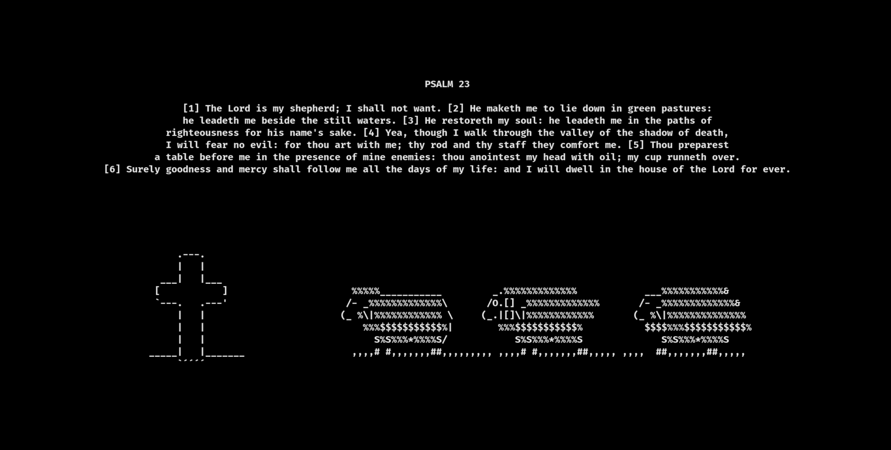

<h1 align="center">J316</h1>



## About

j316 is a customizable screensaver that allows you to use your terminal as a friendly reminder of God's word

Although is intended to be used with bible verses, it is extensible to any other text or ascci art.

## Demo Profiles

| Profile name | Verse |
| --- | --- |
| j316 (default) | John 3:16-18 KJV |
| p23 | Psalm 23 KJV |

## Usage

After installing you can use the binary with the same name (rpm/deb packages)

```bash
j316
j316 -h
j316 -l
j316 -p [ANY_OTHER_PROFILE]
```

Any other distro or development usage by using the .sh file (right after clone)

```bash
./j316.sh
...
```
Text sizing can be done by using Ctrl  + and Ctrl -

For exiting the screensaver just press any other key

### Adding custom profiles

You can add more verses as profiles in ~/.config/j316/config.yaml 

```yaml
profile:
  YOUR_PROFILE_NAME:
    top_left: "/your_route_to/top_left.ascii"
    top_center: "/your_route_to/top_center.ascii"
    top_right: "/your_route_to/top_right.ascii"
    centered_text: "/your_route_to/centered_text.txt"
    bottom_left: "/your_route_to/bottom_left.ascii"
    bottom_center: "/your_route_to/bottom_center.ascii"
    bottom_right: "/your_route_to/bottom_right.ascii"
    title: "OPTIONAL"

  OTHER_PROFILE:
    ...
```
### Profiles usage

```bash
j316 -p p23
```




## Acknowledgements

```text
"For of him, and through him, and to him, are all things: to whom be glory for ever. Amen." 
Romans 11:36
```